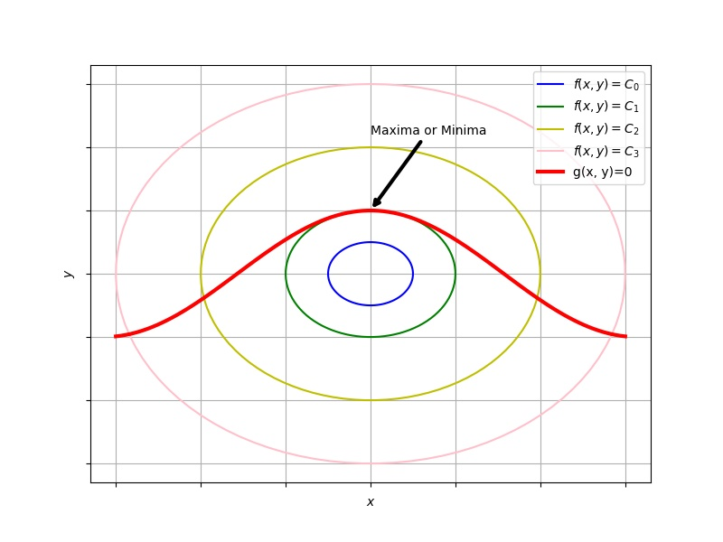

<!-- toc -->

<!-- more -->

## 问题

圆柱体积恒定，求表面积最大值。

也就是说，在 $V = \pi r^2h$ 的约束下，求函数 $A = 2\pi r^2 + 2\pi rh$ 的最小值。

## 求解

约束 $V = \pi r^2h$ 在变量 $r-h$ 构成的直角坐标下，是一条线。

所求的量  $A = 2\pi r^2 + 2\pi rh$ 在$r-h$ 构成的平面内，当 $A$ 取不同的值时，对应不同的线，所以它就对应一簇线，每一条线上的所有的点都对应 $A$ 取相同的值。

线 $V = \pi r^2h$ 与很多条 $A = 2\pi r^2 + 2\pi rh$ 相交

要做的就是在 $V = \pi r^2h$ 这条线上找一个点，这个点是和某一条 $A = 2\pi r^2 + 2\pi rh$ 的交点，而且再也找不到另一个点与另一条更大的  $A = 2\pi r^2 + 2\pi rh$ 相交。

所以这时两条线应该相切，也就是它们的垂线是平行的，也就是
$$
\frac{\partial}{\partial r}（2\pi r^2 +2\pi r h） =\lambda \frac{\partial}{\partial r}（ \pi r^2h）
$$

$$
\frac{\partial}{\partial h}（2\pi r^2 +2\pi r h） =\lambda \frac{\partial}{\partial h}（ \pi r^2h）
$$

可得
$$
\lambda = 2r 
$$

$$
h =2r
$$

# 一般形式

求二维函数 $f(x,y)=0$ 在约束 $g(x,y)=0$ 下的极值. 那么, $f(x,y)$ 的等高线与约束相切的点就是极值. 如图

 [picture code](./2018-09-22-专业笔记-Lagrange乘子法求带有约束的极植/fig.py) 

高维可以做类似的推广.

## 后续补充

画图

例题

一般形式

