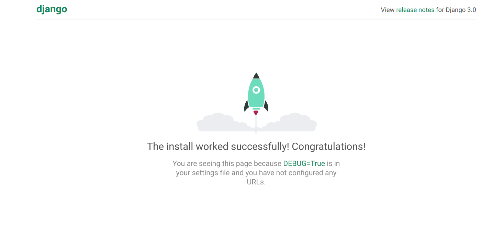
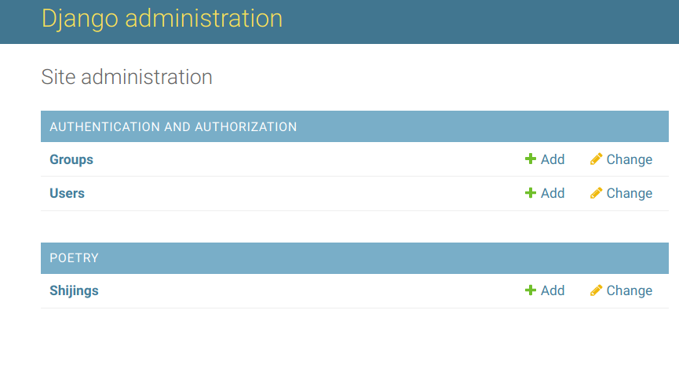
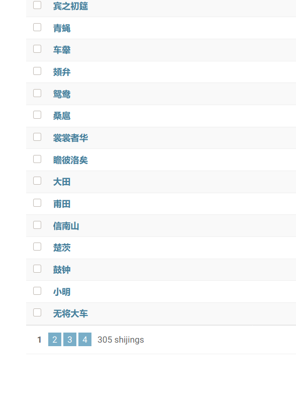
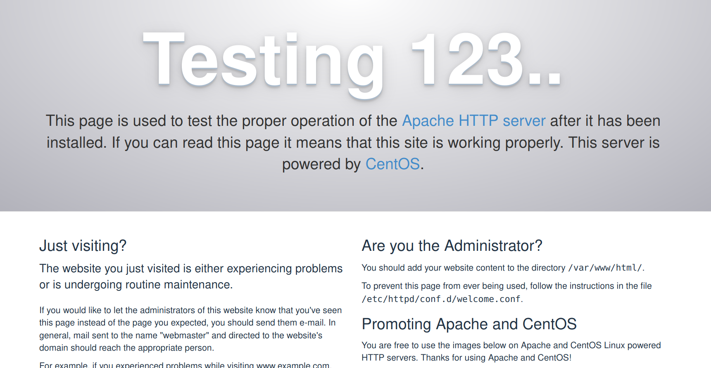

<!-- toc -->

<!-- more -->

# 写在前面的声明

本人非专业人士，对于写程序只是业余爱好。以下内容仅供参考，我一个业余人士也不能保证内容的准确性，对一些命令的解释也只是为了便于记忆和理解，更加专业准确的知识还请查询如官方文档这样的资料。

# 引言

## 思路

寒假在家，又不能出门，闲来无事，又不太想学习，就尝试了用在华为云上买的学生价服务器，在 CentOS 上用 Apache+Mariadb+Django 来搭建一个网站，目标是能够显示内容即可，而对安全性，实用性，美观性不做要求。

网站内容是显示《诗经》的所有内容。数据来自于 github 上的诗词数据库 https://github.com/chinese-poetry/chinese-poetry ，在此感谢此项目中的贡献者表示感谢！

大体思路是：

1. 在服务器上开放所需要的端口，安装所需要的 Apache, Mariadb, Python3。
2. 建立一个虚拟环境，在虚拟环境中用 pip 安装 Django, pymysql, mod_wsgi。
3. 修改各种设置，使 Django 能够和 Apache, Mariadb 正常连接。
4. 写一个程序，把诗经的数据从 json 文件中复制到数据库中
5. 编写 Django 中的文件，使其从数据库中读取诗经的数据，并在网页上展示。

写这篇笔记的目的，首先是记录过程为自己作备忘。其次，是想将一些过程的目的说出来，便于和我一样在尝试搭建的人理解为什么要这样做。

## 云服务器的对比

我先后买过腾讯云，阿里云，华为云提供的学生价服务器，最便宜的配置大概都在10元／月不到。真的很棒，感谢他们！

这三家的配置大致差不多，不过三家中只有阿里云，在学生期间可以，不限次数不限期限地以学生价续费。其它两家都对期限以及续费的次数有所限制。目前我在腾讯云买的已经到期了，华为云上刚刚买的，阿里云上的可以一直用。

# 系统环境

- 操作系统：CentOS Linux release 7.7.1908 (Core)
- Mariadb 版本：mysql  Ver 15.1 Distrib 5.5.64-MariaDB, for Linux (x86_64) using readline 5.1
- Apache 版本：Apache/2.4.6 (CentOS)
- Python 版本：Python 3.7.3
- 确保端口开放

# 记号说明

```shell
$
```

表示在本地运行的命令。

```shell
[root@cloud] $
```

表示在云服务器上以 root 用户运行命令。

```shell
(.sabafun)[root@cloud]$
```

表示在在云服务器的虚拟环境 .sabafun 中以 root 用户运行命令。

# 安装 Apache, Mariadb, Python3

升级软件包，安装 apache（在 yum 库中名字叫 httpd）, mariadb, emacs(文本编辑器，个人偏好，可选)，并开启，然后设置开机自启。

```shell
[root@cloud]$ yum upgrade

[root@cloud]$ yum install httpd httpd-devel
[root@cloud]$ yum systemctl start httpd
[root@cloud]$ yum systemctl enable httpd

[root@cloud]$ yum install mariadb mariadb-server
[root@cloud]$ yum systemctl start mariadb
[root@cloud]$ yum systemctl enable mariadb

[root@cloud]$ yum install emacs
```

在 CentOS 上，用 yum 命令来安装，升级，删除软件。yum upgrade 升级软件包，yum install 安装某个软件。systemctl 用来对服务进行开启，关闭，重启等操作。常用的有：systemctl start 开启服务，systemctl stop 停止服务，systemctl restart 重启服务，systemctl enable 让服务开机自启。

通过安装 Anaconda 来安装 Python3.7，（yum 库中是Python3.6，版本有点低，会报错）。从 Anaconda 官网下载安装包后，进入到安装包所在的目录进行安装

```shell
[root@cloud]$ bash ./Anaconda3-2019.07-Linux-x86_64.sh 
```

./ 表示当前路径。

# 安装虚拟环境 virtualenv

安装完 Anaconda 后，并没有自动将 python3.7 添加到环境变量中，因此直接把路径完整地打出来，来运行 pip

```shell
[root@cloud]$ /root/anaconda3/bin/pip install virtualenv
```

pip 是 Python 的包管理工具，安装一些 Python 包都可以用 pip install 来安装。

安装 virtualenv 是为了给 Django 建立一个独立的 Python 环境，下面可以看出这样做的好处。

# 创建虚拟环境

安装好 virtualenv 后，进入到想要进行工作的目录，通过 virtualenv 创建一个虚拟环境，用来进行后续的活动

```shell
[root@cloud]$ virtualenv .sabafun --python=/root/anaconda3/bin/python3
```

-- 后面的参数表示：以指定的 Python 版本创建虚拟环境，这里指定的是我们安装的 Anaconda 中的 Python 3。不加这个参数，就会以系统默认的 Python2.7。创建的虚拟环境名字叫做 .sabafun 前面的点是为了将存放虚拟环境的文件夹隐藏，也可以不加 点。

进入虚拟环境，此时可以再确认一下 Python 版本

```shell
[root@cloud]$ source .sabafun/bin/activate
(.sabafun)[root@cloud]$ python --version
Python 3.7.3
(.sabafun)[root@cloud]$ pip --version
pip 20.0.2 from /root/sabafun/.sabafun/lib/python3.7/site-packages/pip (python 3.7)
```

进入虚拟环境中，在命令的开头会出现 (.sabafun) ，表示在虚拟环境中。可以看出，在虚拟环境中直接运行 Python 就是我们创建虚拟环境时指定的 Python 版本。这样就和系统的环境隔离来，以避免一些冲突，因为如果将系统的 Python 绑定到 Python3.7 会导致系统中一些依赖 Python2 的程序无法正常运行。

source 命令是让某些文件中的设置立即生效，这里是使虚拟环境中的设置生效。source 还用于当我们修改配置文件中的环境变量后，source 一下配置文件，就可以使配置马上生效，而不需要重启设备。

要停止使用虚拟环境,可执行命令 deactivate 

```shell
(.sabafun)[root@cloud]$ deactivate 
[root@cloud]$ 
```

执行后，前面的 (.sabafun) 就消失了，表示退出了虚拟环境。如果想要删除虚拟环境，直接将保存虚拟环境的文件夹删除就行。

# 安装 Django，创建项目

在虚拟环境中，用 pip 安装 Django，然后新建一个项目，名字叫作 sabafun

```shell
(.sabafun)[root@cloud]$ pip install django
(.sabafun)[root@cloud]$ django-admin startproject sabafun .
```

注意不要漏掉最后的点'.'。这个命令末尾的句点让新项目使用合适的目录结构。如果漏了，就把这个项目的文件夹删除，再重新创建一次。

# 启动用于开发的 web 服务器

在启动 web 服务器测试之前，需要做一些准备工作。

首先，将服务器的 IP 加到项目的设置文件 sabafun/settings.py 中，即将 ALLOWED_HOSTS 项修改为

```python
ALLOWED_HOSTS = [‘服务器IP地址’]
```

然后启动 Django 自带的用于测试的 web 服务器

```shell
(.sabafun)[root@cloud]$ python manage.py runserver 0.0.0.0:8000
```

对项目的一些操作都保存在 mange.py 文件中。出现关于数据库的提示可以忽略。Django 默认用 SQLite 作数据库。而我们不用它，而是用 Mariadb。

此时从本地访问 http://你的服务器IP:8000 ，出现如下小火箭界面，表示成功



如果无法访问，可以查看一下服务器的 8000 端口是否开放。一般都可以从云服务器的管理页面中找到安全组设置。

# Django 的大致工作流程

比较业余的理解，Django 是一个用 Python 写网站的框架。我们可以用 Python 语言写一些函数来实现想要的功能。web 服务器，如 Apache，负责将我们设计好的功能提供给浏览器。而 mod_wsgi 负责将我们用 Python 写的功能翻译给 Apache。网站的数据，如我们用于展示的《诗经》就存储在 Mariadb 数据库中。

所以我们通过网址访问网站，Apache 接收到我们的请求，wsgi 将请求翻译给 Django，Django 从数据库中读取到数据，然后再通过 wsgi 这位翻译发送给 Apache，Apache 将数据发送给我们的浏览器，我们就看到了我们想要的东西。

# 通过 mod_wsgi 连接 Apache

我们上面看到的小火箭的页面，所用的 web 服务器不是 Apache ，而是 Django 自带的用于开发测试的 web 服务器，真正运行网站时，就要连接像 Apache, Nginx 这样的 web服务器。

下面就设置一下，让 Apache 作为 web 服务器。

首先安装负责 Apache 和 Python3 之间进行通信的 mod_wsgi 模块

```shell
(.sabafun)[root@cloud]$ pip install mod_wsgi
```

wsgi 是 Web Server Gateway Interface 的缩写。参考 Django 的官方文档 https://docs.djangoproject.com/zh-hans/3.0/howto/deployment/wsgi/modwsgi/ 和 https://modwsgi.readthedocs.io/en/develop/ 进行设置。

安装好 mod_wsgi 后，查看 wsgi 和 Apache 的接头暗号

```shell
(.sabafun)[root@cloud]$ mod_wsgi-express module-config
LoadModule wsgi_module "/root/sabafun/.sabafun/lib/python3.7/site-packages/mod_wsgi/server/mod_wsgi-py37.cpython-37m-x86_64-linux-gnu.so"
WSGIPythonHome "/root/sabafun/.sabafun"
```

第一行是告诉 Apache 在哪里能够找到 wsgi 。第二行是告诉 Apache ，Django 所使用的 Python在哪里。

然后将接头暗号写入 Apache 的配置文件 /etc/httpd/conf/httpd.conf ，在其末尾添加以下内容

```mysql
#　加载模块
LoadModule wsgi_module "/root/sabafun/.sabafun/lib/python3.7/site-packages/mod_wsgi/server/mod_wsgi-py37.cpython-37m-x86_64-linux-gnu.so"

WSGIScriptAlias / /root/sabafun/sabafun/wsgi.py
WSGIPythonHome /root/sabafun/.sabafun
WSGIPythonPath /root/sabafun

<Directory /root/sabafun/sabafun>
<Files wsgi.py>
Require all granted
</Files>
</Directory>
```

WSGIPythonPath 是告诉 Apache 项目所在的地方。WSGIScriptAlias 是说 wsgi.py 文件在哪。wsgi.py 文件 Django 已经写好了，我们不用动，里面包含了 Apache 如何与 Django 交流的方法 。

同样是 Apache 的配置文件 /etc/httpd/conf/httpd.conf ，修改 ServerName 项为

```mysql
ServerName 你的服务器IP:80
```
修改项目的权限，以便 Apache 有权限读取我们创建的项目

```shell
(.sabafun)[root@cloud]$ chmod 755 -R /root/
```

chmod 是 change mode单词前缀的组合，用来修改文件的权限。755 是用八进制表示的权限，7 就是最高权限，三个数字分别表示文件所有者，用户组以及其它用户的权限，具体参考 https://zh.wikipedia.org/wiki/Chmod 。

然后重启 Apache 服务

```shell
(.sabafun)[root@cloud]$ systemctl restart httpd
```

直接访问 IP ，出现了小火箭，这时的小火箭是通过 Apache 给我们的，说明 Django 能够和 Apache 交流了。

# 设置 Mariadb 数据库

首先初始化数据库

```shell
(.sabafun)[root@cloud]$ mysql_secure_installation
```

它会让我们设置数据库的 root 用户密码等。

用 root 用户登陆数据库

```shell
# mysql -u root -p
```

参数 -u 表示 user，后面跟用户名，参数 -p 表示 password。

登陆数据库后，为 Django 创建一个用户，然后再为我们的项目创建一个数据库，并设置权限

```mysql
MariaDB [(none)]> create user django@localhost identified by '密码';
MariaDB [(none)]> create database sabafun character set utf8mb4 collateutf8mb4_unicode_ci;
MariaDB [(none)]> grant all on sabafun.* to django@localhost;
MariaDB [(none)]> exit
```

django@localhost 是说用户名是 django，localhost 表示是本地用户。sabafun 是数据库的名字。character 之后的内容是设置编码。一定注意设置编码！要不然可能没法导入中文！注意不要漏掉每条命令后的分号。命令不区分大小写。

grant 是设置数据库的权限。all 表示权限的种类是所有权限， sabafun.* 表示要设置权限的数据库是 sabafun，* 表示这个数据库中所有的表，to 后面是将权限所赋予的用户。

创建一个数据库就好像创建一个 Excel 文件，一个数据库中有好多表，不同的表就像 Excel 文件中的 sheet1, sheet2...，而每一个表中有好多行和列存储具体的数据。只不过数据库中的数据可能关系要复杂一些。

创建用户后，可以查看已有的数据库，来确认刚刚创建的数据库确实已经存在

```
MariaDB [(none)]> show databases;
```

当然也可以不创建新用户，而是让 Django 直接用 root 用户。创建新用户是出于便于管理和考虑安全性。

# 连接 Mariadb

首先安装 pymysql

```shell
(.sabafun)[root@cloud]$ pip install pymysql
```

它使 Python3 能够读取 Mariadb 中的数据。

修改项目中关于数据库的设置。参考 https://docs.djangoproject.com/zh-hans/3.0/ref/settings/#std:setting-DATABASES 。

修改文件

```shell
 __init__.py 
```

这个文件中的设置对整个项目都有效。修改为

```python
import pymysql
pymysql.version_info = (1, 3, 13, "final", 0)
pymysql.install_as_MySQLdb()
```

它的意思是导入 pymysql 模块。第二行是为了解决一个 bug , 是个坑不加的话就会提示数据库的版本过低。第三行如字面意思。

然后修改设置文件 sabafun/settings.py 中的 DATABASES 项：

```python
DATABASES = {
    'default': {
        'ENGINE': 'django.db.backends.mysql',
        'NAME': 'sabafun',
        'USER': 'django',
        'PASSWORD': '密码',
        'HOST': 'localhost',
        'PORT': '3306',
        'CHARSET': 'utf8',
        'COLLATION':  'utf8_general_ci',
    }
}

```

里面都如字面意思，告诉 Django 怎么访问数据库。让它用 django 用户名访问我们创建好的 sabafun 数据库。

# 创建超级用户

接下来为项目创建一个超级用户，它能够方便地查看和修改项目的一些信息。

```shell
(.sabafun)[root@cloud]$ python manage.py createsuperuser
```

然后迁移数据库，将我们创建和超级用户的相关信息存入我们之前设置好的数据库

```shell
(.sabafun)[root@cloud]$ python manage.py makemigrations
No changes detected
(.sabafun)[root@cloud]$ python manage.py migrate
```

如果出现一串 'OK' ，没有报错，则连接 Mariadb 数据库成功！

之后启动 Django 用于开发测试的 web 服务器

```shell
(.sabafun)[root@cloud]$ python manage.py runserver 0.0.0.0:8000
```

之所以不用 Apache，是因为 Django 用于开发的服务器在需要的情况下会对每一次的访问请求重新载入一遍 Python 代码。而用 Apache 的话，每次修改都要重启 Apache 服务。Django 的文档中说

> 会自动重新加载的服务器 [`runserver`](https://docs.djangoproject.com/zh-hans/3.0/ref/django-admin/#django-admin-runserver)
>
> 用于开发的服务器在需要的情况下会对每一次的访问请求重新载入一遍 Python 代码。所以你不需要为了让修改的代码生效而频繁的重新启动服务器。然而，一些动作，比如添加新文件，将不会触发自动重新加载，这时你得自己手动重启服务器。

# 创建 poetry 应用

Django项目由一系列应用程序组成，它们协同工作，让项目成为一个整体。我们创建一个 poetry 应用，来实现网站展示一些古诗词的功能

```shell
(.sabafun)[root@cloud]$ python manage.py startapp poetry
```

创建应用后，在项目文件夹中会出现相应的文件夹。

# 创建 poetry/urls.py　文件

这个文件用来说明 poetry 应用对应的网址是什么样的

```python
from django.urls import path

from . import views

urlpatterns = [
    path('', views.poetry, name='poetry'),
]
```

# 修改 sabafun/urls.py 文件

这个文件是整个项目的网址管理

```python
(.sabafun)[root@cloud]$ emacs sabafun/urls.py 

from django.contrib import admin
from django.urls import path, include

urlpatterns = [
    path('poetry/', include('poetry.urls')),
    path('admin/', admin.site.urls),
]
```

# 创建 Shijing Models

修改文件 poetry/models.py 

```python
from django.db import models

# Create your models here.                                                    

class Shijing(models.Model):
    """诗经"""
    fixed_id = models.IntegerField(default=0)
    title = models.CharField(max_length=32, default='')
    chapter = models.CharField(max_length=32, default='')
    section = models.CharField(max_length=32, default='')
    content = models.TextField(max_length=8000, default='')

    def __str__(self):
        """返回模型的字符串表示"""
        return self.title
```

这个 Shijing 类就对应于数据库中的一个表，一个实例就对应于表中的一条记录，也就是一行。fixed_id, title, chapter... 这些对应于一条记录包含的属性。

# 注册 poetry 应用

修改 sabafun/settings.py 文件，告诉 Django ，我们创建了一个新的应用

```python
INSTALLED_APPS = [
    'django.contrib.admin',
    'django.contrib.auth',
    'django.contrib.contenttypes',
    'django.contrib.sessions',
    'django.contrib.messages',
    'django.contrib.staticfiles',

    # My apps                                                             
    'poetry'，
]
```

# 迁移数据库

修改 poetry/admin.py ，将创建的 Shijing 添加到管理页面中

```python
from django.contrib import admin

# Register your models here.                                                  

from .models import Shijing

admin.site.register(Shijing)
```

然后迁移数据库

```shell
(.sabafun)[root@cloud]$ python manage.py makemigrations
(.sabafun)[root@cloud]$ python manage.py migrate
```

这时，Django 就在数据库中为 Shijing 类中创建了一个表，但是还没有任何记录，是一个空表。

启动 Django 用于开发测试的 web 服务器

```shell
(.sabafun)[root@cloud]$ python manage.py runserver 0.0.0.0:8000
```

在本地通过浏览器访问 IP::8000/admin/ 就会看到 Shijing



# 迁入 json 数据

然后将 github 上的诗词数据库 https://github.com/chinese-poetry/chinese-poetry 中的 shijing.json 传到服务器上，并在同一目录下编写文件 json_to_database.py

```python
(.sabafun)[root@cloud]$ emacs json_to_database.py

# -*- coding: <encoding name> -*-                                             
'''将 json 转换到数据库'''
# https://shockerli.net/post/python3-pymysql/                                 

import json
import pymysql

import os
print(os.getcwd())

# 连接数据库。假设数据库中已经建好了名为 poetry 的空数据库。                  
poetry = pymysql.connect(host='localhost',
                         port=3306,
                         user='django',
                         password='*********',
                         db='sabafun',
                         charset='utf8')
cursor = poetry.cursor()


# 转存《诗经》。                                                              
# 读取 shijing.json 到变量 shijing 中。                                       
with open('./shijing.json', 'r', encoding='UTF-8') as f:
    shijing = json.load(f)

# 查看 shijing.json 中有哪些 key                                              
# for k in shijing[0].keys():                                                 
#     print(k)    
# 为 shijing 创建一个表。                                                     
# cursor.execute('''                                                          
#                create table shijing(id int not null auto_increment,         
#                                     title varchar(32) not null,             
#                                     chapter varchar(32) not null,           
#                                     section varchar(32) not null,           
#                                     content varchar(8000) not null,         
#                                     primary key (id)                        
#                                    )                                        
#                ''')                                                         


# 将数组写入数据库。                                                          
shijing_sql = ('insert into poetry_shijing (title, chapter, section, content,\
 fixed_id)'
               + 'values (%s, %s, %s, %s, %s)')
shijing_values = [list(v.values()) for v in shijing]  # 将字典转换为数组      
i = 0
for v in shijing_values:                              #                       
    v[3] = '\n'.join(v[3])                            # 将数组转换为字符串    
    i += 1                                            # 添加 fixed_id 字段    
    v.append(i)

cursor.executemany(shijing_sql, shijing_values[:])  # 写入数据库              
poetry.commit()                                      # 提交更改               
```

然后运行它

```shell
(.sabafun)[root@cloud]$ python json_to_database.py
```

就把 305 首诗经导入到数据库中了！

进入管理界面，看到 305 个导入的数据



成功！

# 修改 poetry/views.py 文件

至此为止，我们只能够在管理页面中看到诗经，下面让它在网页上显示。

```python
from django.shortcuts import render

# Create your views here.                                                     

from django.http import HttpResponse

from .models import Shijing

def poetry(request):
    context = {'shijing_list': Shijing.objects.all()}
    return render(request, 'poetry/poetry.html', context)
```

poetry 函数将一个字典 context 传递给渲染函数 render()

# 编写网页模板

新建一个用于存放 html 模板的地方

```shell
(.sabafun)[root@cloud sabafun]# cd poetry/
(.sabafun)[root@cloud poetry]# mkdir templates
(.sabafun)[root@cloud poetry]# cd templates/
(.sabafun)[root@cloud templates]# mkdir poetry
(.sabafun)[root@cloud templates]# ls
poetry
```

编写模板文件 poetry/templates/poetry/poetry.html

```html
<body>                                                                        
                                                
<center>                                                                      
第{{ item.fixed_id }}篇：                                                     
<h1>                                                                          
  {{ item.chapter }}·{{ item.section }}·{{ item.title }}                      
</h1>                                                                         
<h2>{{ item.content }}</h2>                                                   
                                                                  
</center>                                                                     
</body>                                                                       
```

shijing_list 就是通过 render() 函数传递过来的字典的键。重启 httpd 从本地访问 IP/poetry，就看到如下界面了！


# 后续操作

Apache 配置

```
# 连接 Django                                                                 
LoadModule wsgi_module "/root/sabafun/.sabafun/lib/python3.7/site-packages/mo\
d_wsgi/server/mod_wsgi-py37.cpython-37m-x86_64-linux-gnu.so"

WSGIScriptAlias / /root/sabafun/sabafun/wsgi.py
WSGIPythonHome /root/sabafun/.sabafun
WSGIPythonPath /root/sabafun

<Directory /root/sabafun/sabafun>
<Files wsgi.py>
Require all granted
</Files>
</Directory>


# 文件服务, 如果不配置, 当关闭 Debug 时, 会无法访问静态文件. 具体方法参考 Django 官方文档中的说明
#Alias /robots.txt /path/to/mysite.com/static/robots.txt                      
#Alias /favicon.ico /path/to/mysite.com/static/favicon.ico                    

#Alias /media/ /path/to/mysite.com/media/                                     

Alias /static /root/sabafun/static_cdn/
#Alias /static/ /path/to/mysite.com/static/                                   

<Directory /root/sabafun/static_cdn/>
Require all granted
</Directory>

# <Directory /path/to/mysite.com/media>                                       
# Require all granted                                                         
# </Directory>                                                                

# WSGIScriptAlias / /path/to/mysite.com/mysite/wsgi.py                        

# <Directory /path/to/mysite.com/mysite>                                      
# <Files wsgi.py>                                                             
# Require all granted                                                         
# </Files>                                                                    
# </Directory>                                                                
```

settings.py 中关于静态文件的配置

```
# Static files (CSS, JavaScript, Images)                                      
# https://docs.djangoproject.com/en/3.0/howto/static-files/                   

# 会在每个 app_name/static/app_name 及总的 mysite/static 下找静态文件
STATIC_URL = '/static/'

# collectstatic 时存放静态文件的地方, 这个路径提供给 Apache
STATIC_ROOT = os.path.join(BASE_DIR, 'static_cdn')

# 总的 mysite/static 下找静态文件
STATICFILES_DIRS = [
    os.path.join(BASE_DIR, 'static')
]
```


# 具体操作过程（仅供参考）

## 配置 ssh 登陆

在本地连接云端

```shell
$ ssh root@h.saba.fun
```

输入密码，确认云端可以登录。

为了不用每次连接都输入密码，以后采用密钥的方式登录。进入云端的 .ssh 目录，进行查看

```shell
[root@cloud]$ cd .ssh/
```

进入 .ssh 目录后，确认目录下的文件

```shell
[root@cloud]$ ls
authorized_keys
[root@cloud]$ pwd
/root/.ssh
[root@cloud]$ logout
```

将本地的公钥传到云端

```shell
$ scp ~/.ssh/xps13.pub root@h.saba.fun:/root/.ssh
xps13.pub                                   100%  744     6.8KB/s   00:00 
```

再回到云端

```shell
$ ssh root@h.saba.fun
```

加入公钥

```shell
[root@cloud]$ cat .ssh/xps13.pub >> .ssh/authorized_keys 
```

此时从本地登陆云端就不需要输入密码了。

## 配置环境

在云端进行升级

```shell
[root@cloud]$ yum upgrade
```

查看 Python 版本

```shell
[root@cloud]$ python --version
Python 2.7.5
```

是 Python2 。Django 需要 Python3 因此安装 

```shell
[root@cloud]$ yum install python3
```

 安装后查看确认

```shell
[root@cloud]$  python3 --version
Python 3.6.8
[root@cloud]$ pip3 --version
pip 9.0.3 from /usr/lib/python3.6/site-packages (python 3.6)
```

安装 Apache

```shell
[root@cloud]$ yum install httpd
```

运行 

```shell
[root@cloud]$ systemctl start httpd
```

从本机登录 IP 会看到测试界面




让 Apache 开机自动运行

```shell
[root@cloud]$ systemctl enable httpd
```

安装 Mariadb

```shell
[root@cloud]$ yum install mariadb
[root@cloud]$ yum install mariadb-server
```

## 配置并测试 Django

新建一个存放项目的文件夹并进入

```shell
[root@cloud]$ mkdir saba
[root@cloud]$ cd saba
```

用 Pip3 安装虚拟环境

```shell
[root@cloud]$ pip3 install virtualenv
```

创建虚拟环境

```shell
[root@cloud]$ virtualenv .sabaenv
```

激活虚拟环境

```shell
[root@cloud]$ source .sabaenv/bin/activate
```

成功后在终端的前面会出现

```shell
(.sabaenv)[root@cloud]$
```

此时环境中就是 Python3 了

```shell
(.sabaenv)[root@cloud]$ pip --version
pip 20.0.2 from /root/saba/.sabaenv/lib/python3.6/site-packages/pip (python 3.6)
(.sabaenv)[root@cloud]$ python --version 
Python 3.6.8
```

安装 Django

```shell
(.sabaenv)[root@cloud]$ pip install django
```

创建项目

```shell
(.sabaenv)[root@cloud]$ django-admin startproject sabafun
```

查看确认

```
(.sabaenv)# ls -alh
total 16K
drwxr-xr-x  4 root root 4.0K Feb  4 11:59 .
dr-xr-x---. 7 root root 4.0K Feb  4 11:47 ..
drwxr-xr-x  5 root root 4.0K Feb  4 11:52 .sabaenv
drwxr-xr-x  3 root root 4.0K Feb  4 11:59 sabafun

```

```shell
(.sabaenv)[root@cloud]$ cd sabafun/
(.sabaenv)[root@cloud]$ ls
manage.py  sabafun
(.sabaenv)[root@cloud]$ ls sabafun/
asgi.py  __init__.py  settings.py  urls.py  wsgi.py

```

```shell
(.sabaenv)[root@cloud]$ python manage.py runserver 0.0.0.0:8000
Watching for file changes with StatReloader
Exception in thread django-main-thread:
Traceback (most recent call last):
  File "/usr/lib64/python3.6/threading.py", line 916, in _bootstrap_inner
    self.run()
  File "/usr/lib64/python3.6/threading.py", line 864, in run
    self._target(*self._args, **self._kwargs)
  File "/root/saba/.sabaenv/lib/python3.6/site-packages/django/utils/autoreload.py", line 53, in wrapper
    fn(*args, **kwargs)
  File "/root/saba/.sabaenv/lib/python3.6/site-packages/django/core/management/commands/runserver.py", line 109, in inner_run
    autoreload.raise_last_exception()
  File "/root/saba/.sabaenv/lib/python3.6/site-packages/django/utils/autoreload.py", line 76, in raise_last_exception
    raise _exception[1]
  File "/root/saba/.sabaenv/lib/python3.6/site-packages/django/core/management/__init__.py", line 357, in execute
    autoreload.check_errors(django.setup)()
  File "/root/saba/.sabaenv/lib/python3.6/site-packages/django/utils/autoreload.py", line 53, in wrapper
    fn(*args, **kwargs)
  File "/root/saba/.sabaenv/lib/python3.6/site-packages/django/__init__.py", line 24, in setup
    apps.populate(settings.INSTALLED_APPS)
  File "/root/saba/.sabaenv/lib/python3.6/site-packages/django/apps/registry.py", line 114, in populate
    app_config.import_models()
  File "/root/saba/.sabaenv/lib/python3.6/site-packages/django/apps/config.py", line 211, in import_models
    self.models_module = import_module(models_module_name)
  File "/root/saba/.sabaenv/lib64/python3.6/importlib/__init__.py", line 126, in import_module
    return _bootstrap._gcd_import(name[level:], package, level)
  File "<frozen importlib._bootstrap>", line 994, in _gcd_import
  File "<frozen importlib._bootstrap>", line 971, in _find_and_load
  File "<frozen importlib._bootstrap>", line 955, in _find_and_load_unlocked
  File "<frozen importlib._bootstrap>", line 665, in _load_unlocked
  File "<frozen importlib._bootstrap_external>", line 678, in exec_module
  File "<frozen importlib._bootstrap>", line 219, in _call_with_frames_removed
  File "/root/saba/.sabaenv/lib/python3.6/site-packages/django/contrib/auth/models.py", line 2, in <module>
    from django.contrib.auth.base_user import AbstractBaseUser, BaseUserManager
  File "/root/saba/.sabaenv/lib/python3.6/site-packages/django/contrib/auth/base_user.py", line 47, in <module>
    class AbstractBaseUser(models.Model):
  File "/root/saba/.sabaenv/lib/python3.6/site-packages/django/db/models/base.py", line 121, in __new__
    new_class.add_to_class('_meta', Options(meta, app_label))
  File "/root/saba/.sabaenv/lib/python3.6/site-packages/django/db/models/base.py", line 325, in add_to_class
    value.contribute_to_class(cls, name)
  File "/root/saba/.sabaenv/lib/python3.6/site-packages/django/db/models/options.py", line 208, in contribute_to_class
    self.db_table = truncate_name(self.db_table, connection.ops.max_name_length())
  File "/root/saba/.sabaenv/lib/python3.6/site-packages/django/db/__init__.py", line 28, in __getattr__
    return getattr(connections[DEFAULT_DB_ALIAS], item)
  File "/root/saba/.sabaenv/lib/python3.6/site-packages/django/db/utils.py", line 207, in __getitem__
    backend = load_backend(db['ENGINE'])
  File "/root/saba/.sabaenv/lib/python3.6/site-packages/django/db/utils.py", line 111, in load_backend
    return import_module('%s.base' % backend_name)
  File "/root/saba/.sabaenv/lib64/python3.6/importlib/__init__.py", line 126, in import_module
    return _bootstrap._gcd_import(name[level:], package, level)
  File "/root/saba/.sabaenv/lib/python3.6/site-packages/django/db/backends/sqlite3/base.py", line 68, in <module>
    check_sqlite_version()
  File "/root/saba/.sabaenv/lib/python3.6/site-packages/django/db/backends/sqlite3/base.py", line 65, in check_sqlite_version
    raise ImproperlyConfigured('SQLite 3.8.3 or later is required (found %s).' % Database.sqlite_version)
django.core.exceptions.ImproperlyConfigured: SQLite 3.8.3 or later is required (found 3.7.17).
(.sabaenv) [root@ecs-sn3-medium-2-linux-20200114152809 sabafun]# pip install SQLite
ERROR: Could not find a version that satisfies the requirement SQLite (from versions: none)
ERROR: No matching distribution found for SQLite
```

```shell
(.sabaenv)[root@cloud]$ pip install db-sqlite3
```

还是不行。重新安装 Python 吧。

安装 Anaconda 。它的 Python 版本比较新

```shell
(.sabaenv)[root@cloud]$ deactivate
[root@cloud]$ bash ./Anaconda3-2019.07-Linux-x86_64.sh 
[root@cloud]$ /root/anaconda3/bin/python3 --version
Python 3.7.3
```

重新来

```bash
[root@cloud]$ rm -rf saba/
[root@cloud]$ mkdir sabafun
[root@cloud]$ cd sabafun
```
```shell
[root@cloud]$ virtualenv .sabafun --python=/root/anaconda3/bin/python3
```

进入虚拟环境

```shell
[root@cloud]$ source .sabafun/bin/activate
(.sabafun)[root@cloud]$ python --version
Python 3.7.3
(.sabafun)[root@cloud]$ pip --version
pip 20.0.2 from /root/sabafun/.sabafun/lib/python3.7/site-packages/pip (python 3.7)
```

这时的版本应该没问题了。

接下来再把之前的工作重复一遍

```shell
(.sabafun)[root@cloud]$ pip install django
Collecting django
  Using cached Django-3.0.3-py3-none-any.whl (7.5 MB)
Collecting asgiref~=3.2
  Using cached asgiref-3.2.3-py2.py3-none-any.whl (18 kB)
Collecting pytz
  Using cached pytz-2019.3-py2.py3-none-any.whl (509 kB)
Collecting sqlparse>=0.2.2
  Using cached sqlparse-0.3.0-py2.py3-none-any.whl (39 kB)
Installing collected packages: asgiref, pytz, sqlparse, django
Successfully installed asgiref-3.2.3 django-3.0.3 pytz-2019.3 sqlparse-0.3.0
```

一定记得加末尾的点

```shell
(.sabafun)[root@cloud]$ django-admin startproject sabafun .
(.sabafun)[root@cloud]$ python manage.py runserver 0.0.0.0:8000
Watching for file changes with StatReloader
Performing system checks...

System check identified no issues (0 silenced).

You have 17 unapplied migration(s). Your project may not work properly until you apply the migrations for app(s): admin, auth, contenttypes, sessions.
Run 'python manage.py migrate' to apply them.

February 04, 2020 - 04:50:05
Django version 3.0.3, using settings 'sabafun.settings'
Starting development server at http://0.0.0.0:8000/
Quit the server with CONTROL-C.
```

一次试运行不成功提示

```
You may need to add '***.***.***.***' to ALLOWED_HOSTS.
```
安装我 熟悉的 emacs 编辑器

```shell
(.sabafun)[root@cloud]$ yum install emacs
```

将服务器的 IP 加到设置中

```shell
(.sabafun)[root@cloud]$ emacs sabafun/settings.py 
```

将  IP 加入

```python
ALLOWED_HOSTS = [‘你的IP’]
```

保存，退出。再运行（无视数据库提示，因为不用这个）

```shell
(.sabafun)[root@cloud]$ python manage.py runserver 0.0.0.0:8000
Watching for file changes with StatReloader
Performing system checks...

System check identified no issues (0 silenced).

You have 17 unapplied migration(s). Your project may not work properly until you apply the migrations for app(s): admin, auth, contenttypes, sessions.
Run 'python manage.py migrate' to apply them.

February 04, 2020 - 04:57:45
Django version 3.0.3, using settings 'sabafun.settings'
Starting development server at http://0.0.0.0:8000/
Quit the server with CONTROL-C.

```

此时从本地访问 8000 端口，终于出现了小火箭界面


参考官方文档连接 Apache https://docs.djangoproject.com/zh-hans/3.0/howto/deployment/wsgi/modwsgi/

## 连接 mod_wsgi

首先安装 mod_wsgi

```shell
(.sabafun)[root@cloud]$ pip install mod_wsgi
```

参考官方文档连接 Apache https://docs.djangoproject.com/zh-hans/3.0/howto/deployment/wsgi/modwsgi/

根据　https://modwsgi.readthedocs.io/en/develop/　的提示，查看所需要的路径

```shell
(.sabafun)[root@cloud]$ mod_wsgi-express module-config
LoadModule wsgi_module "/root/sabafun/.sabafun/lib/python3.7/site-packages/mod_wsgi/server/mod_wsgi-py37.cpython-37m-x86_64-linux-gnu.so"
WSGIPythonHome "/root/sabafun/.sabafun"

```


```shell
(.sabafun)[root@cloud]$ ls
asgi.py      __pycache__  settings.py~  wsgi.py
__init__.py  settings.py  urls.py
(.sabafun)[root@cloud]$ pwd
/root/sabafun/sabafun
```
```shell
(.sabafun)[root@cloud]$ emacs /etc/httpd/conf/httpd.conf 
```

添加

```mysql
#　加载模块
LoadModule wsgi_module "/root/sabafun/.sabafun/lib/python3.7/site-packages/mod_wsgi/server/mod_wsgi-py37.cpython-37m-x86_64-linux-gnu.so"

WSGIScriptAlias / /root/sabafun/sabafun/wsgi.py
WSGIPythonHome /root/sabafun/.sabafun
WSGIPythonPath /root/sabafun

<Directory /root/sabafun/sabafun>
<Files wsgi.py>
Require all granted
</Files>
</Directory>


```

```shell
(.sabafun)[root@cloud]$ systemctl restart httpd
```

重启后访问服务器 IP 没有反应。因此去查看 Apache 的 error log

```shell
(.sabafun)[root@cloud]$ emacs /etc/httpd/logs/error_log 
```

```mysql
AH00558: httpd: Could not reliably determine the server's fully qualified domain name, using 127.0.0.1. Set the 'ServerName' directive globally to suppress t\
his message
```

```mysql
ServerName 121.36.10.39:80
```

还是不行，再次查看 error log

```mysql
Current thread 0x00007fca65324880 (most recent call first):
[Tue Feb 04 13:31:57.815061 2020] [wsgi:warn] [pid 5238] (13)Permission denied: mod_wsgi (pid=5238): Unable to stat Python ho\
me /root/sabafun/.sabafun. Python interpreter may not be able to be initialized correctly. Verify the supplied path and acces\
s permissions for whole of the path.
Fatal Python error: initfsencoding: unable to load the file system codec
ModuleNotFoundError: No module named 'encodings'

Current thread 0x00007fca65324880 (most recent call first):
```

说是不能访问环境。但是环境的路径没有错，可能是权限问题。经过几次尝试并参考　http://www.jeepxie.net/article/565984.html　后

```shell
(.sabafun)[root@cloud]$ chmod 755 -R /root/
```

再重启 httpd 。直接访问 IP ，出现了小火箭。

## 配置 Mariadb

启动服务（之前忘记安装 mariadb-server，就找不到服务）

```shell
(.sabafun)[root@cloud]$ systemctl start mariadb
```

初始化

```shell
(.sabafun)[root@cloud]$ mysql_secure_installation
```

登陆

```shell
# mysql -u root -p
```

```mysql
MariaDB [(none)]> create user django@localhost identified by '*********';

一定注意设置编码！要不然没法导入中文
MariaDB [(none)]> create database sabafun character set utf8mb4 collate utf8mb4_unicode_ci;
Query OK, 1 row affected (0.00 sec)
MariaDB [(none)]> grant all on sabafun.* to django@localhost;
Query OK, 0 rows affected (0.00 sec)
MariaDB [(none)]> flush privileges;
Query OK, 0 rows affected (0.00 sec)

MariaDB [(none)]>　exit
```

用新用户登陆

```mysql
(.sabafun)[root@cloud]$ mysql -u django -p


MariaDB [(none)]> use sabafun;
Database changed

MariaDB [sabafun]> show tables;
Empty set (0.00 sec)

MariaDB [sabafun]> exit

Bye
```

## 连接　mariadb

修改项目中的　settings.py 中关于数据库的设置 https://docs.djangoproject.com/zh-hans/3.0/ref/settings/#std:setting-DATABASES

```mysql
MariaDB [(none)]> show variables like 'port';
+---------------+-------+
| Variable_name | Value |
+---------------+-------+
| port          | 3306  |
+---------------+-------+
1 row in set (0.00 sec)

```

```shell
(.sabafun)[root@cloud]$ pip install pymysql
Collecting pymysql
  Downloading PyMySQL-0.9.3-py2.py3-none-any.whl (47 kB)
     |████████████████████████████████| 47 kB 13 kB/s 
Installing collected packages: pymysql
Successfully installed pymysql-0.9.3
```

```python
__init.py__:

import pymysql
pymysql.version_info = (1, 3, 13, "final", 0)
pymysql.install_as_MySQLdb()
```

```python

DATABASES = {
    'default': {
        'ENGINE': 'django.db.backends.mysql',
        'NAME': 'sabafun',
        'USER': 'django',
        'PASSWORD': '*********',
        'HOST': 'localhost',
        'PORT': '3306',
        'CHARSET': 'utf8',
        'COLLATION':  'utf8_general_ci',
    }
}

```

测试一下

```shell
(.sabafun)[root@cloud]$ python manage.py makemigrations
No changes detected
(.sabafun)[root@cloud]$ python manage.py migrate
System check identified some issues:

WARNINGS:
?: (mysql.W002) MySQL Strict Mode is not set for database connection 'default'
	HINT: MySQL's Strict Mode fixes many data integrity problems in MySQL, such as data truncation upon insertion, by escalating warnings into errors. It is strongly recommended you activate it. See: https://docs.djangoproject.com/en/3.0/ref/databases/#mysql-sql-mode
Operations to perform:
  Apply all migrations: admin, auth, contenttypes, sessions
Running migrations:
  Applying contenttypes.0001_initial... OK
  Applying auth.0001_initial... OK
  Applying admin.0001_initial... OK
  Applying admin.0002_logentry_remove_auto_add... OK
  Applying admin.0003_logentry_add_action_flag_choices... OK
  Applying contenttypes.0002_remove_content_type_name... OK
  Applying auth.0002_alter_permission_name_max_length... OK
  Applying auth.0003_alter_user_email_max_length... OK
  Applying auth.0004_alter_user_username_opts... OK
  Applying auth.0005_alter_user_last_login_null... OK
  Applying auth.0006_require_contenttypes_0002... OK
  Applying auth.0007_alter_validators_add_error_messages... OK
  Applying auth.0008_alter_user_username_max_length... OK
  Applying auth.0009_alter_user_last_name_max_length... OK
  Applying auth.0010_alter_group_name_max_length... OK
  Applying auth.0011_update_proxy_permissions... OK
  Applying sessions.0001_initial... OK
```

没有报错，连接成功！

## 开始写 Django 页面

创建管理页面

```shell
(.sabafun)[root@cloud]$ python manage.py createsuperuser
```

时候要重启　httpd　才能进入　IP/admin　。而且好像有些问题。因此，在编写项目的过程中用　django　自带的开发服务器，它有一些好处，比如官方文档中说的　

> 会自动重新加载的服务器 [`runserver`](https://docs.djangoproject.com/zh-hans/3.0/ref/django-admin/#django-admin-runserver)
>
> 用于开发的服务器在需要的情况下会对每一次的访问请求重新载入一遍 Python 代码。所以你不需要为了让修改的代码生效而频繁的重新启动服务器。然而，一些动作，比如添加新文件，将不会触发自动重新加载，这时你得自己手动重启服务器。

新开一个终端，进入虚拟环境，打开　django　开发服务器

```shell
$ ssh root@h.saba.fun
[root@cloud]$ cd /root/sabafun/
[root@cloud]$ source .sabafun/bin/activate
(.sabafun)[root@cloud]$ python manage.py runserver 0.0.0.0:8000
Watching for file changes with StatReloader
Performing system checks...

System check identified no issues (0 silenced).
February 04, 2020 - 06:53:48
Django version 3.0.3, using settings 'sabafun.settings'
Starting development server at http://0.0.0.0:8000/
Quit the server with CONTROL-C.
```

## 创建 poetry 应用

```shell
(.sabafun)[root@cloud]$ python manage.py startapp poetry
```

```python
(.sabafun)[root@cloud]$ emacs poetry/views.py 


from django.shortcuts import render

# Create your views here.                                                     

from django.http import	HttpResponse

def poetry(request):
    return HttpResponse("Hello, poetry!")
```

```python
(.sabafun)[root@cloud]$ emacs poetry/urls.py
                                   
from django.urls import path

from . import views

urlpatterns = [
    path('', views.poetry, name='poetry'),
]
```

```python
(.sabafun)[root@cloud]$ emacs sabafun/urls.py 

from django.contrib import admin
from django.urls import path, include

urlpatterns = [
    path('poetry/', include('poetry.urls')),
    path('admin/', admin.site.urls),
]
```

查看　IP:8000/poetry/

出现　Hello, poetry!

成功！

## 创建 Shijing Models

```python
(.sabafun)[root@cloud]$ emacs poetry/models.py 


from django.db import models

# Create your models here.                                                    

class Shijing(models.Model):
    """诗经"""
    fixed_id = models.IntegerField(default=0)
    title = models.CharField(max_length=32, default='')
    chapter = models.CharField(max_length=32, default='')
    section = models.CharField(max_length=32, default='')
    content = models.TextField(max_length=8000, default='')

    def __str__(self):
        """返回模型的字符串表示"""
        return self.title
```

添加　poetry　应用

```python
(.sabafun)[root@cloud]$ emacs sabafun/settings.py


INSTALLED_APPS = [
    'django.contrib.admin',
    'django.contrib.auth',
    'django.contrib.contenttypes',
    'django.contrib.sessions',
    'django.contrib.messages',
    'django.contrib.staticfiles',

    # My apps                                                             
    'poetry'，
]
```

迁移

```shell
(.sabafun)[root@cloud]$ python manage.py makemigrations
Migrations for 'poetry':
  poetry/migrations/0001_initial.py
    - Create model Shijing
(.sabafun)[root@cloud]$ python manage.py migrate
System check identified some issues:

WARNINGS:
?: (mysql.W002) MySQL Strict Mode is not set for database connection 'default'
	HINT: MySQL's Strict Mode fixes many data integrity problems in MySQL, such as data truncation upon insertion, by escalating warnings into errors. It is strongly recommended you activate it. See: https://docs.djangoproject.com/en/3.0/ref/databases/#mysql-sql-mode
Operations to perform:
  Apply all migrations: admin, auth, contenttypes, poetry, sessions
Running migrations:
  Applying poetry.0001_initial... OK
```

```python
(.sabafun)[root@cloud]$ emacs poetry/admin.py 


from django.contrib import admin

# Register your models here.                                                  

from .models import Shijing

admin.site.register(Shijing)
```

这时 IP::8000/admin/　就会看到 Shijing


## 迁入 json 数据

```mysql
删除表中所有条目
truncate table poetry_shijing;
```

传入 shijing.json 并编写文件

```python
(.sabafun)[root@cloud]$ emacs json_to_database.py

# -*- coding: <encoding name> -*-                                             
'''将 json 转换到数据库'''
# https://shockerli.net/post/python3-pymysql/                                 

import json
import pymysql

import os
print(os.getcwd())

# 连接数据库。假设数据库中已经建好了名为 poetry 的空数据库。                  
poetry = pymysql.connect(host='localhost',
                         port=3306,
                         user='django',
                         password='*********',
                         db='sabafun',
                         charset='utf8')
cursor = poetry.cursor()


# 转存《诗经》。                                                              
# 读取 shijing.json 到变量 shijing 中。                                       
with open('./shijing.json', 'r', encoding='UTF-8') as f:
    shijing = json.load(f)

# 查看 shijing.json 中有哪些 key                                              
# for k in shijing[0].keys():                                                 
#     print(k)    
# 为 shijing 创建一个表。                                                     
# cursor.execute('''                                                          
#                create table shijing(id int not null auto_increment,         
#                                     title varchar(32) not null,             
#                                     chapter varchar(32) not null,           
#                                     section varchar(32) not null,           
#                                     content varchar(8000) not null,         
#                                     primary key (id)                        
#                                    )                                        
#                ''')                                                         


# 将数组写入数据库。                                                          
shijing_sql = ('insert into poetry_shijing (title, chapter, section, content,\
 fixed_id)'
               + 'values (%s, %s, %s, %s, %s)')
shijing_values = [list(v.values()) for v in shijing]  # 将字典转换为数组      
i = 0
for v in shijing_values:                              #                       
    v[3] = '\n'.join(v[3])                            # 将数组转换为字符串    
    i += 1                                            # 添加 fixed_id 字段    
    v.append(i)

cursor.executemany(shijing_sql, shijing_values[:])  # 写入数据库              
poetry.commit()                                      # 提交更改               


```

然后运行导入

```shell
(.sabafun)[root@cloud]$ python json_to_database.py
```

进入管理界面，看到 305 个导入的数据


成功！

## 编写网页，来显示

```shell
(.sabafun)[root@cloud sabafun]# cd poetry/
(.sabafun)[root@cloud poetry]# mkdir templates
(.sabafun)[root@cloud poetry]# cd templates/
(.sabafun)[root@cloud templates]# mkdir poetry
(.sabafun)[root@cloud templates]# ls
poetry
```

```html
(.sabafun)[root@cloud sabafun]# emacs poetry/templates/poetry/poetry.html

                                                                              
                                                                              
<body>                                                                        
                                                
                                                                              
                                                                              
<center>                                                                      
第{{ item.fixed_id }}篇：                                                     
<h1>                                                                          
  {{ item.chapter }}·{{ item.section }}·{{ item.title }}                      
</h1>                                                                         
<h2>{{ item.content }}</h2>                                                   
                                                                  
</center>                                                                     
</body>                                                                       
```

```python
(.sabafun)[root@cloud sabafun]# emacs poetry/views.py


from django.shortcuts import render

# Create your views here.                                                     

from django.http import HttpResponse

from .models import Shijing

def poetry(request):
    context = {'shijing_list': Shijing.objects.all()}
    return render(request, 'poetry/poetry.html', context)
```

重启 httpd 从本地访问 IP/poetry，就看到界面了


# 参考资料

1. Eric Matthes 著，袁国忠 译, Python 编程从入门到实践，中国工信出版集团，2016，人民邮电出版社
2. https://docs.djangoproject.com/zh-hans/3.0/intro/tutorial01/
3. www.google.com

