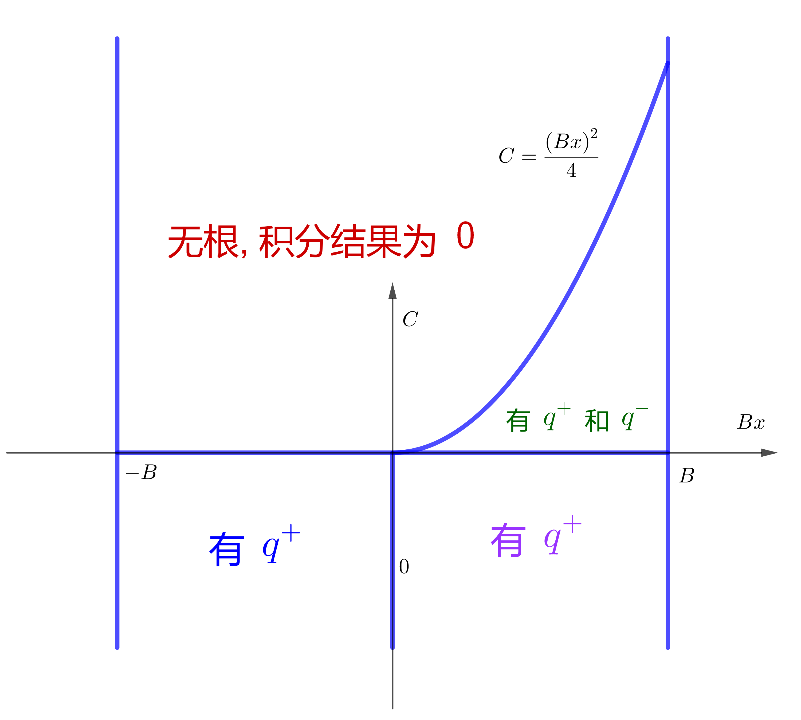

<!-- toc -->

<!-- more -->

# 问题积分

$$
\begin{align}
I(\Omega) =& \frac{1}{2\pi}\int_0^{\infty}\mathrm{d}^3\vec{q}\cdot
        \mathrm{Im} \left[\frac{1}{q^2-16q\cos\theta+2(\Omega+14)+\mathrm{i}0^+}\right]\\
        =& \frac{1}{2\pi}\int_0^{\infty}\mathrm{d}q
                         \int_0^{\pi}\mathrm{d}\theta
                         \int_0^{2\pi}\mathrm{d}\phi \cdot
        \mathrm{Im} \left[\frac{q^2\sin\theta}
                 {q^2-16q\cos\theta+2(\Omega+14)+\mathrm{i}0^+}\right]\\
    =&\int_0^{\infty}\mathrm{d}q\int_{-1}^1\mathrm{d}x \cdot\mathrm{Im}\left[ 
    \frac{q^2}{q^2-16qx+2(\Omega+14)+\mathrm{i}0^+}
  \right]
\end{align}
$$

# 全部解析地积: 先积 $x$ 再积 $q$

$$
\begin{align}
I(\Omega) =&\int_0^{\infty}\mathrm{d}q \cdot \frac{q}{16}\mathrm{Im}\left[
   \ln\left(q^2+16q+2(\Omega+14)+\mathrm{i}0^+\right)
  -\ln\left(q^2-16q+2(\Omega+14)+\mathrm{i}0^+\right)
    \right] \\
    =& -\pi \theta(18-\Omega)\sqrt{2(18-\Omega)}
\end{align}
$$

# 全部解析地积: 先积 $q$ 对积 $x$ 

$$
\begin{align}
I(\Omega) =&-\pi\int_{-1}^1\mathrm{d}x \int_0^{\infty}\mathrm{d}q\cdot 
    q^2\frac{\delta(q-q^+)+\delta(q-q^-)}{|q^+-q^-|}\\
    =&-\pi\left[\int_{-1}^1\mathrm{d}x \cdot\frac{\theta(-\Omega-14)q^{+2}}{|q^+-q^-|}
      +\int_\sqrt{\frac{\Omega+14}{32}}^1\mathrm{d}x\cdot 
                 \frac{\theta(\Omega+14)\theta(18-\Omega)
                \left( q^{+2}+q^{-2} \right)}{|q^+-q^-|}\right]\\
    =& -\pi\theta(18-\Omega)\sqrt{2(18-\Omega)}
\end{align}
$$

# 解析积 $q$ , 数值积 $x$
$$
\begin{align}
I(\Omega) =&-\pi\int_{-1}^1\mathrm{d}x \int_0^{\infty}\mathrm{d}q\cdot 
    q^2\frac{\delta(q-q^+)+\delta(q-q^-)}{|q^+-q^-|}\\
        =&\int_0^{\infty}\mathrm{d}q\int_{-1}^1\mathrm{d}x \cdot\mathrm{Im}\left[ 
    \frac{q^2}{q^2-16qx+2(\Omega+14)+\mathrm{i}0^+}
  \right](通否化成 q 复平面上的积分?)\\
    =&-\pi\left[\int_{-1}^1\mathrm{d}x \cdot\frac{\theta(-\Omega-14)q^{+2}}{|q^+-q^-|}
      +\int_\sqrt{\frac{\Omega+14}{32}}^1\mathrm{d}x\cdot 
                 \frac{\theta(\Omega+14)\theta(18-\Omega)
                \left( q^{+2}+q^{-2} \right)}{|q^+-q^-|}\right]
\end{align}
$$

其中
$$
\begin{align}
\Delta =& (16x)^2-8(\Omega+14) \\
q^{\pm} =& \frac{16x \pm\sqrt{\Delta}}{2}
\end{align}
$$
而
$$
|q^+ - q^-| = \sqrt{\Delta}
$$

$$
\begin{align}
\int_{-1}^{1}\mathrm{d}x\cdot\frac{q^{+2}}{|q^+-q^-|} 
  =& \frac{1}{4}\int_{-1}^{1}\mathrm{d}x\cdot\left(32x + \sqrt{\Delta}+\frac{(16x)^2}{\sqrt{\Delta}}\right) \\
  =& \frac{1}{4}\int_{-1}^{1}\mathrm{d}x\cdot\left(32x + \sqrt{(16x)^2-8(\Omega+14)}+
         \frac{(16x)^2}{\sqrt{(16x)^2-8(\Omega+14)}}\right)
\end{align}
$$

$$
\begin{align}
\int_\sqrt{\frac{\Omega+14}{32}}^1\mathrm{d}x\cdot\frac{q^{+2}+q^{-2}}{|q^+-q^-|} 
  =& \frac{1}{2}\int_\sqrt{\frac{\Omega+14}{32}}^1\mathrm{d}x\cdot\frac{(16x)^2+ \Delta}{\sqrt{\Delta}} \\
  =& \frac{1}{2}\int_\sqrt{\frac{\Omega+14}{32}}^1\mathrm{d}x\cdot\left[\frac{(16x)^2}{\sqrt{\Delta}} +\sqrt{\Delta}\right] \\
 =& \frac{1}{2}\int_\sqrt{\frac{\Omega+14}{32}}^1\mathrm{d}x\cdot\left[\frac{(16x)^2}{\sqrt{(16x)^2-8(\Omega+14)}} +\sqrt{(16x)^2-8(\Omega+14)}\right]
\end{align}
$$
上面这两个积分, 想通过数值计算. 值得注意的是, 被积函数在积分下限处发散, 但是 $\mathcal{O}\left(x^{-\frac{1}{2}}\right)$ 形式的发散, 积分结果并不发散. 比如当 $\Omega=-6$ 时
$$
\begin{align}
\int_\sqrt{\frac{\Omega+14}{32}}^1\mathrm{d}x\cdot\frac{q^{+2}+q^{-2}}{|q^+-q^-|} 
 =& \frac{1}{2}\int_\sqrt{\frac{\Omega+14}{32}}^1\mathrm{d}x\cdot\left[\frac{(16x)^2}{\sqrt{(16x)^2-8(\Omega+14)}} +\sqrt{(16x)^2-8(\Omega+14)}\right] \\
  =& \frac{1}{2}\int_\frac{1}{2}^1\mathrm{d}x\cdot\left[\frac{(16x)^2}{\sqrt{(16x)^2-64}} +\sqrt{(16x)^2-64}\right]
\end{align}
$$
# 普遍情况

积分
$$
I(B,C,x) = \int_{0}^{\infty}\mathrm{d}q\cdot \mathrm{Im}\left[ 
        \frac{q^2f(q)}{q^2 - qBx+C+\mathrm{i}0^+}\right] 
        ,\quad \mathrm{for} \,\, x\in[-1,1],B>0
$$

分母中关于 $q$ 的二次函数的根的判别式
$$
\begin{align}
\Delta =& (Bx)^2 -4C \\
\Delta >& 0 \Rightarrow  C<\frac{(Bx)^2}{4} \\
\end{align}
$$
只有 $\Delta>0$ 时, 积分才不为零. 此时分母中关于 $q$ 的二次函数有两个根
$$
q^{\pm} = \frac{Bx\pm\sqrt{\Delta}}{2}
$$
取虚部
$$
\begin{align}
I(B,C,x) =& -\pi\int_0^{\infty}\mathrm{d}q\cdot 
           q^2f(q)\frac{\delta(q-q^+)+\delta(q-q^+)}{|q^+-q^-|} \\
         =& -\pi\int_0^{\infty}\mathrm{d}q\cdot 
           q^2f(q)\frac{\delta(q-q^+)+\delta(q-q^+)}{\sqrt{\Delta}}
\end{align}
$$

对 $q$ 的积分范围是 $[0, \infty]$ , 因此 $q^{\pm}>0$ 时, 对应的 Dirac delta 函数才对积分有贡献.

$q^+>0$ 的条件为

- 当 $x>0$ 时: $q^+>0$ 恒成立. 

- 当 $x < 0$ 时: 若要 $q^+ > 0$ , 应有 $Bx+\sqrt{\Delta}>0 \Rightarrow C<0$ .

$q^->0$ 的条件为

- 当 $x < 0$ 时: $q ^ - < 0$ 恒成立, 即 $q^+ > 0$ 恒不成立.
- 当 $x>0$ 时: 若要 $q^->0$ 应有 $Bx-\sqrt{\Delta}>0 \Rightarrow C>0$ .

所以对积分有贡献的区域如下图

因此, 积分化为

$$
\begin{align}
I(B,C,x) =& -\pi\int_0^{\infty}\mathrm{d}q\cdot 
           q^2f(q)\frac{\delta(q-q^+)+\delta(q-q^+)}{\sqrt{\Delta}} \\
         =& -\pi \left[ \theta(-C)\frac{f(q^+)q^{+2}}{\sqrt{\Delta}}
            + \theta(C)\theta\left(\frac{(Bx)^2}{4}-C\right)
              \theta\left(\sqrt{\frac{4C}{B}}-x\right)
            \frac{f(q^+)q^{+2}+f(q^-)q^{-2}}{\sqrt{\Delta}}\right]
\end{align}
$$

# Supplementary

## 先积 $x$ 再积 $q$ 的详细过程

$$
 \begin{align}I(\Omega) =&\int_0^{\infty}\mathrm{d}q \cdot \frac{q}{16}\mathrm{Im}\left[   \ln\left(q^2+16q+2(\Omega+14)+\mathrm{i}0^+\right)  -\ln\left(q^2-16q+2(\Omega+14)+\mathrm{i}0^+\right)    \right] \\    =& -\pi \theta(18-\Omega)\sqrt{2(18-\Omega)}\end{align}
$$

上式中第二个等号的计算细节.

只有当第一个对数中大于零, 第二个对数中小于零时积分才不为零.

二次函数根的判别式相同, 为
$$
\begin{align}
\Delta = 16^2-8(\Omega + 14)\\
\Delta > 0 \Rightarrow \Omega < 18 \\
\sqrt{\Delta} > 16 \Rightarrow \Omega < 14
\end{align}
$$
第一项的根为
$$
q^{\pm}= \frac{-16 \pm \sqrt{\Delta}}{2}
$$

第二项的根为
$$
q^{\pm}= \frac{16 \pm \sqrt{\Delta}}{2}
$$
积分不为零的条件为
$$
\begin{align}
0<\frac{\sqrt{\Delta}-16}{2}<q<\frac{\sqrt{\Delta}+16}{2},\quad \mathrm{if}\quad \sqrt{\Delta}>14 \\
0<\frac{16-\sqrt{\Delta}}{2}<q<\frac{16+\sqrt{\Delta}}{2},\quad \mathrm{if}\quad \sqrt{\Delta}<14
\end{align}
$$
所以积分结果为
$$
\begin{align}
I(\Omega) =& -\pi\left[ 
\theta(14-\Omega)\left.\frac{q^2}{32}\right|_{q=\frac{\sqrt{\Delta}-16}{2}}^{q=\frac{\sqrt{\Delta}+16}{2}}
+\theta(\Omega-14)\theta(18-\Omega)\left.\frac{q^2}{32}\right|_{q=\frac{16-\sqrt{\Delta}}{2}}^{q =\frac{16+\sqrt{\Delta}}{2}}
\right]\\
=&-\pi \theta(18-\Omega)\frac{\sqrt{\Delta}}{2} \\
=& -\pi \theta(18-\Omega)\sqrt{2(18-\Omega)}
\end{align}
$$

## 先积 $q$ 再积 $x$ 的详细过程

$$
\begin{align}
I(\Omega) =&-\pi\int_{-1}^1\mathrm{d}x \int_0^{\infty}\mathrm{d}q\cdot 
    q^2\frac{\delta(q-q^+)+\delta(q-q^-)}{|q^+-q^-|}\\
        =&-\pi\left[\int_{-1}^1\mathrm{d}x \cdot\frac{\theta(-\Omega-14)q^{+2}}{|q^+-q^-|}
      +\int_\sqrt{\frac{\Omega+14}{32}}^1\mathrm{d}x\cdot 
                 \frac{\theta(\Omega+14)\theta(18-\Omega)
                \left( q^{+2}+q^{-2} \right)}{|q^+-q^-|}\right]\\
    =& -\pi \left[ \theta(-\Omega-14)\left.\cdot \frac{x}{4}
         \sqrt{(16x)^2-8(\Omega+14)}\right|_{x=-1}^{x=1}   \\
       +\left.\theta(\Omega+14)\theta(18-\Omega)\cdot \frac{x}{2}
         \sqrt{(16x)^2-8(\Omega+14)}\right|_{x=\sqrt{\frac{\Omega+14}{32}}}^{x=1}
    \right]\\
    =& -\pi \left[ \theta(-\Omega-14)\left.\cdot \frac{x}{2}
         \sqrt{(16x)^2-8(\Omega+14)}\right|_{x=0}^{x=1}   \\
       +\left.\theta(\Omega+14)\theta(18-\Omega)\cdot \frac{x}{2}
         \sqrt{(16x)^2-8(\Omega+14)}\right|_{x=\sqrt{\frac{\Omega+14}{32}}}^{x=1}
    \right]\\
    =& -\pi \left[ \theta(-\Omega-14)\left.\cdot \frac{x}{2}
         \sqrt{(16x)^2-8(\Omega+14)}\right|_{x=0}^{x=1}   \\
       +\left.\theta(\Omega+14)\theta(18-\Omega)\cdot \frac{x}{2}
         \sqrt{(16x)^2-8(\Omega+14)}\right|_{x=\sqrt{\frac{\Omega+14}{32}}}^{x=1}
    \right] \\
    =& -\pi\theta(18-\Omega)\sqrt{2(18-\Omega)}
\end{align}
$$

# 总结

数值积分的时候, 注意某个点发散但积分不发散的情况.