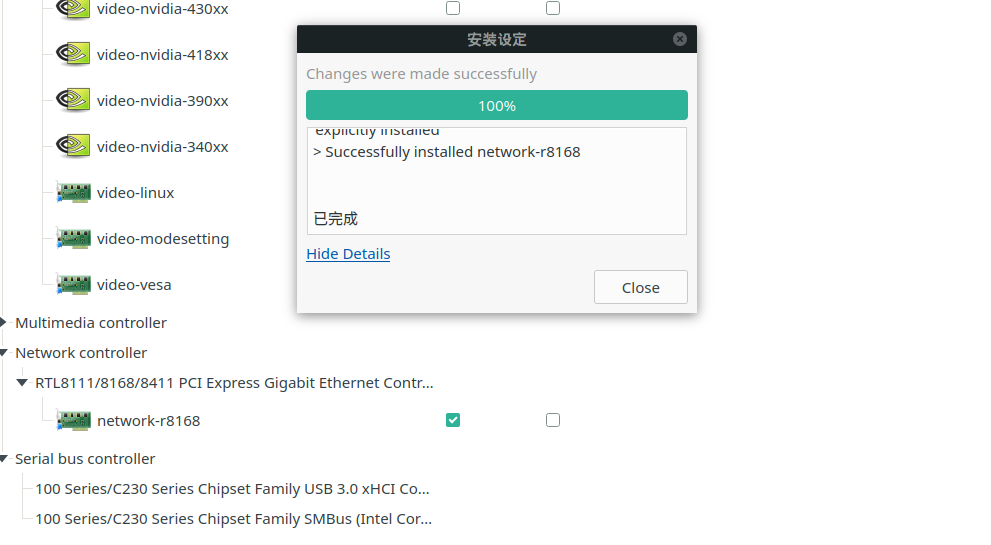
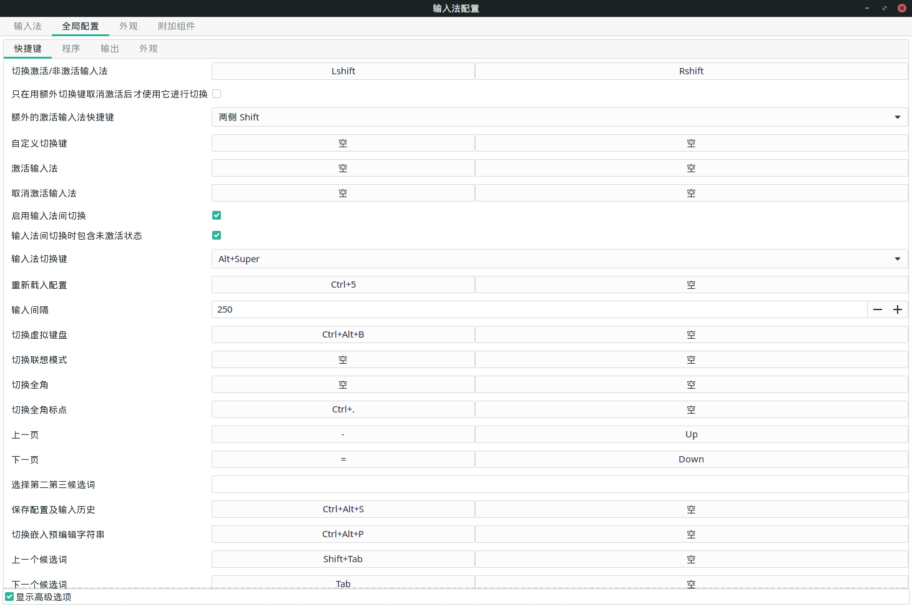

<!-- toc -->

<!-- more -->

# 引言

办公室电脑原来的机械硬盘实在有点不行了, 换了一块新的 SSD.

本来想买个再好一点的, 但是主板有只有 sata 接口. 虽说再折腾一下也可以换更高级的 SSD, 但是也没(有)那(点)么(懒)多(啊)时(啊)间. 

我发现 11 月份没有写新的博客. 就这样水?一篇吧! 其实这个可以合在之前那篇 manjaro 装机 note 里的的.

# 买 SSD

我之前只知道 SSD 分好几种, 具体也没怎么研究过. 要自己买当然要拆开看看主板上有什么接口. 哎, 自己看了半天也不知道哪个是 SSD接口. 把图片发给店家, 立马知道要买什么样的了!

原来主板上有空的 sata 接口, 而且之前我也没有意识到 SSD 是用线与主板相连的, 还以为是像内存一样直接插上的, 怪不得没有找到插口.

在卖家的帮忙下(吐嘈一下, 东芝改名叫铠侠, 觉得不如原来好听) , 买了 SSD 和 sata 线.

# 装 SSD

很快啊, 新的 SSD 第二天就来了. 一拿的感觉是: 轻!

直接插上 sata 线连上, 开机! 竟然没有识别. 思考为什么会这样的时候, 瞟了一眼说明说: SSD 还需要接电源的! 看来"不用读系列"有时候还是要看的. 我说这硬盘上怎么有两块呲出来的.

可是我并没有买电源线. 就在我一边责怪卖家没有告诉我, 一边又想又得再等一天快递了, 一边又想从哪个废旧电脑上拆一根时, 突然又想到光驱也是 sata 线连到主板上的, 应该也有电源线. 机智如我, 直接拔下来接到了 SSD 上. 开机, 开不了机了, 原来那里接的是机械硬盘. 又一次偶然发现, 这根电源线中间还伸出一个头. 不错, 接上, 完美解决!

# 安装 SSD manjaro

记录一下注意的点. Bootloader 选到 KIOXIA (新 SSD ) 上, BIOS select device 也先 KIOXIA.


# 幽灵般的网络

在 SSD 上装 win10 和 manjaro 很顺利. 但接下来有一件事我至今不明白是为什么.

win10 是有网的. 然后装 manjaro, 打开之后没网. 心想是网络配置不对. 然后打开机械硬盘上的 manjaro 对一下配置. 再重启进 SSD manjaro, 突然有网了. 虽然奇怪, 但问题自己好了. 

在 SSD manjaro 上进行了一些设置后, 重启, 又没网了, 啊! 再重启进机械硬盘 manjaro, 啊, 机械 manjaro 也没网了, 很奇怪啊, 之前 机械 manjaro 用了很久, 也没有出现连不上网的情况. 怀疑是办公室的网络出问题了, 进 SSD win10, 也没网, 更加断定我的判断. 

问了一下别人, 有网?

那是我这根线上的路由器被我搞冲突了? 但是 yf 的还有网, 而且又边了它的网线, 也连不上网, 它的电脑却能连上. 那就是我电脑的问题了.

应该也不是软件的问题, 因为无论新旧, 四个系统每个都边不上网.

硬件问题, 难道是我装 SSD 的时候碰到了什么? 不应该啊! 有点迷惑!

在 yf 提醒下, 将 SSD 拆下来, 进机械 win10, 进不去了... 进机械 manjaro, 啊, 竟然能连上, 真的太奇怪了! 难道接上 SSD 导致其它部分供电不足?

又把 SSD 装回去, 又能连上了...

从 SSD manjaro 重启再进 SSD manjaro 又边不上了.

再从 SSD manjaro 重启进 SSD win10 可以.

再从 SSD win10 进 SSD manjaro, 又可以了.

从 SSD manjaro 重启再进 SSD manjaro 又边不上了.

再从 SSD manjaro 重启进 SSD win10 可以.

再从 SSD win10 进 SSD manjaro, 又可以了.

看来 SSD manjaro 的网络需要 SSD win10 的唤醒...

又想起之前对机械和 SSD manjaro 配置的时候网上驱动不太一样, 但是重启后好了, 没有在意. 现在又边不上了. 这就把驱动弄地一样. 好了

一切都好了, 是网卡驱动的问题. 之前 cy 机械硬盘 manjaro 连不上网估计也是这个问题.

但是!!! 之前四个系统都连不上的原因我依然不知道, 我能想到的就只能是... 想不到是为什么 . 太奇怪了!

附网上安装: 右键安装



# wayland 换 xorg

奇怪的网络问题让我对了机械和 SSD 的 gnome 版本, 发现新的 manjaro 包默认是 wayland. 我突然意识到之前给 cy 的机械硬盘装 manjaro 后闪屏的问题, 很有可能也是用了 wayland.

换回 Xorg 直接安装 Xorg 包就好了

```shell
sudo pacman -S xorg 
```

登陆选 xorg 的 gnome 即可.

# 输入法

arch wiki 关于中文输入法的部分升级了, 存放环境变量的文件有了变化, 详见: https://wiki.archlinux.org/index.php/Fcitx_(%E7%AE%80%E4%BD%93%E4%B8%AD%E6%96%87)#.E5.AE.89.E8.A3.85

还是比较习惯之前的快捷键设置, 截图记录.




# evince 中文问题

之前装 xpdf 就好了, 可这次不好使了. 这样, 也促使我找到了问题的原因: https://blog.csdn.net/nevasun/article/details/7303529 okular, epdfview, evince的pdf功能均由xpdf的分支poppler提供，poppler从fontconfig的配置文件中读取字体取代pdf里的字体。

这次安装 `poppler-data` 就好了

# emacs 开启卡顿

看卡顿的时间, 卡顿完字体变大, 推测是 cnfonts 的问题, 注释掉就好了

```lisp
;; 字体设置
;;(require 'cnfonts)
;; 让 cnfonts 随着 Emacs 自动生效。
;;(cnfonts-enable)
;; 让 spacemacs mode-line 中的 Unicode 图标正确显示。
;;(cnfonts-set-spacemacs-fallback-fonts)
```

# 修改默认 shell

新的 manjaro 包默认的 shell 也改成了 zsh. 不过我还是习惯原来的 bash. 改下面的文件就可以:

```shell
sudo emacs /etc/passwd 
```

# GRUB theme

新的 manjaro 包里也没有了 GRUB theme, 有点不好看, 可以直接 `yaourt grub theme` 找到 manjaro 的 grub theme 安装就好.

# 开机挂载

旧的机械硬盘可以设置开机自动挂到某个目录, 方法是修改 `/etc/fstab` , 比如增加记录

```shell
/dev/sda5				  /docu		 ntfs	 defaults		    0 0
```

# 对 manjaro 版本时用到的命令

```shell
lsb_release -a
```

# 对 hexo

hexo 貌似对新版的 node 支持不友好, 需要将 node 进行版本回退才可以正常 deploy. 

用 `n` 来管理和切换 node 版本. 

查看 node 版本

```shell
node -v
```

安装

```shell
npm install -g n
```

下载 hexo 可用的 node 版本 13.14.0

```shell
sudo n 13.14.0
```

切换版本是与上面相同的命令

或许有一天, 我该把 blog 换到 pelican 上面, 毕竟比较熟悉语言.

# VirtualBox

不仅需要安装 virtualbox, 还需要安装宿主机对应内核的 host modules. `umane -a` 查看 Linux 内核版本, 比如我的结果是 5.8.18, 所以还要安装 `linux58-virtualbox-host-modules` .

两个安装好之后, 还要激活模块(这个在安装 virtualbox 时有过一行提示)

```shell
sudo modprobe vboxdrv
```

之后即可正常使用

 